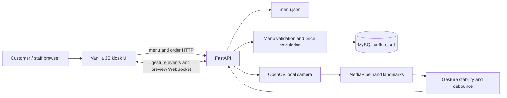
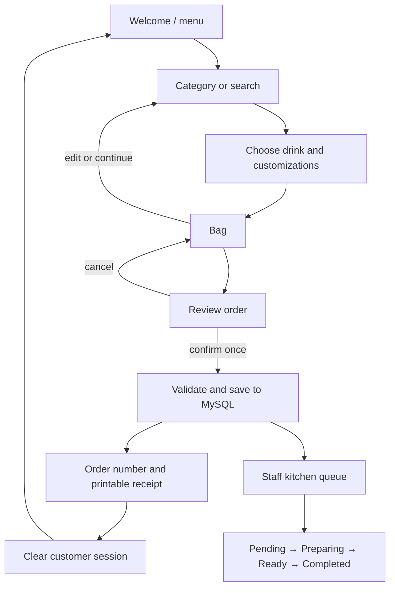

# Architecture and verification

## Component boundaries

The CV path reports commands and camera status; it does not import or mutate menu, cart, prices or order storage. The API owns order validation and MySQL persistence. The browser cart is a session-scoped convenience; the server rebuilds prices and customization labels from menu data before persistence.

## Customer flow

## Manual verification checklist

Run the app using the README instructions, then check:

- Menu loads, category filters and search narrow results, and unavailable products cannot be added.
- Size, milk and add-on changes update the visible price; cart edits and quantity changes update totals.
- Checkout creates one pending order, prints a receipt, and shows a unique order number.
- Repeating the same API request with the same `idempotencyKey` returns its original order rather than inserting another.
- Server-side pricing follows `data/menu.json` even if a request includes a forged `unitPrice` (the API ignores browser-supplied prices).
- Kitchen statuses persist after refresh and follow the four documented values.
- After installing CV extras, the camera preview appears on Gesture Help, status changes with hand visibility, and gestures produce commands without storing camera frames.
- Closing/disconnecting the camera leaves touch, mouse and keyboard ordering available.
- Leave the kiosk idle to see the warning and then verify the cart is cleared after the timeout.

This is a manual checklist, not an automated test suite. Camera recognition should be calibrated under the lighting and camera placement used in the actual kiosk.
